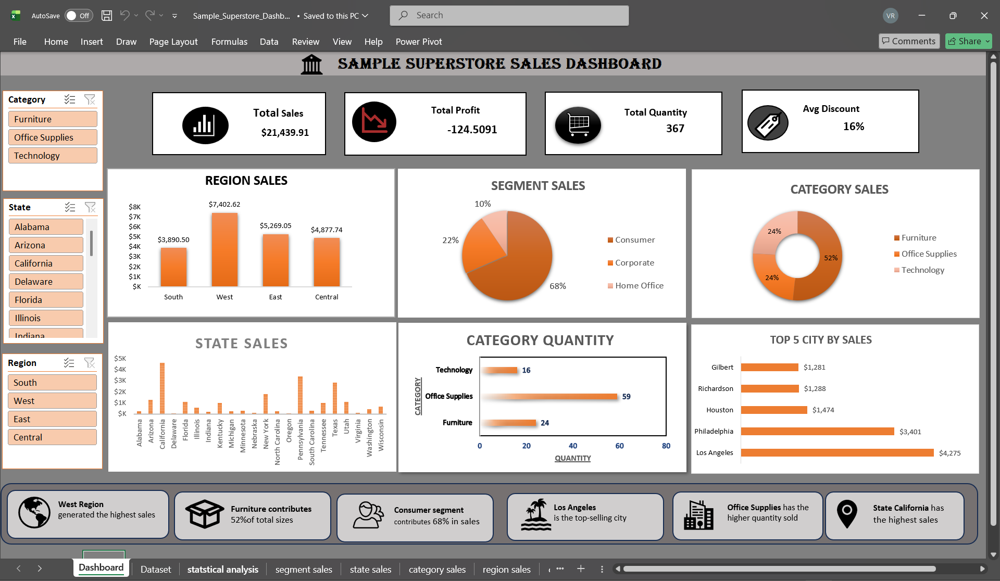

# Superstore Sales Dashboard (Excel)

## Project Overview
This project is an interactive Excel dashboard developed using the Sample Superstore dataset. It provides business insights through dynamic KPI cards, Pivot Tables, Pivot Charts, and Slicers to analyze sales performance across different dimensions.

## Tools Used
- Microsoft Excel
- Pivot Tables
- Pivot Charts
- Slicers
- KPI Cards
- Data Visualization

## Dashboard Features
- Interactive Dashboard
- Dynamic KPI Cards
- Sales by Region
- Sales by Customer Segment
- Category-wise Sales
- State-wise Sales
- Top 5 Cities by Sales
- Top 5 Subcategories by Sales
- Profit by Ship Mode
- Statistical Analysis

## Dashboard Preview

## Dataset
Sample Superstore Dataset

## Skills Demonstrated
- Data Cleaning
- Data Analysis
- Dashboard Design
- Data Visualization
- Business Insights
- Excel Reporting
